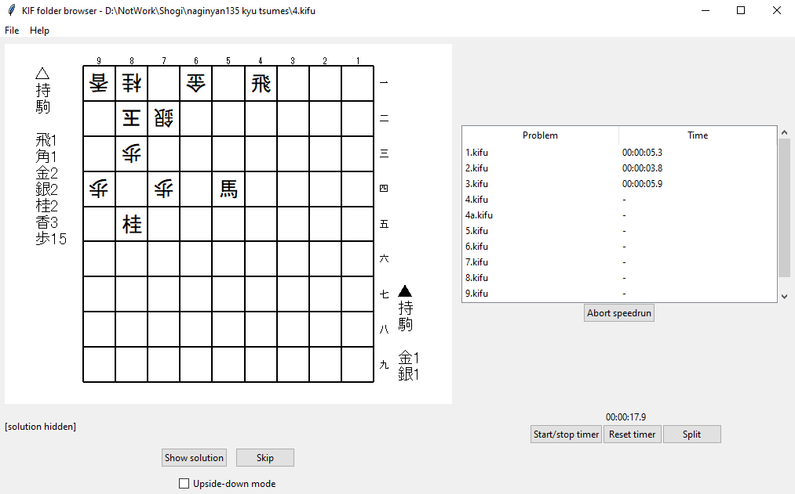

# KIF browser #

Navigate through a folder of tsumeshogi problems with ease. For each problem, see the board position and view the solution when done solving.

Shogi players may have hundreds of tsumeshogi stored in .kif files. However, as far as I'm aware there isn't a program to quickly go through these files. For stronger players who can solve each problem at a glance, the total time taken opening each file in turn can be many times more than the actual solving.

This little bit of Python aims to let shogi players train with their large collections of tsumeshogi quickly and efficiently.

## How to install ##

Dependencies: Python 3.5 (tested with 3.8.1) or later, TKinter 8.6 or later, Pillow (tested with 8.1.0)

Download the repo into the working directory of your choice, e.g. `git svn clone https://github.com/Marken-Foo/kif-browser/trunk`.

To run, run kif_browser_gui.py, e.g. `python3 kif_browser_gui`.

Comes with a free set of ten 1-te and ten 3-te problems in the folder `/sample_problems`, composed by Marken Foo.

### Less-technical instructions ###

You'll need Python 3, which will help you run Python (.py) code files on your computer. You can download an installer for the latest version from the [official Python website](https://www.python.org/). It also comes with TKinter.

You'll also need Pillow, which lets Python files deal with images. Once you've installed Python (let it change your PATH variable when installing!), open a console (Command Prompt, Windows Powershell, Mac Terminal, Bash, etc). Type `pip install Pillow` and press enter. This should install Pillow.

Finally, download everything in this repository. You can go to the [main page of this repository](https://github.com/Marken-Foo/kif-browser), click the green "Code" at the top right of the file list, and you can download everything as a zip file.

(If you're a bit more familiar with the command line and if you have git, just run `git svn clone https://github.com/Marken-Foo/kif-browser/trunk` in the working directory of your choice.)

Finally, to run the program, double click `kif_browser_gui.py` or run it from the command line with Python.

## How to use ##

From the menu bar, "File -> Open folder...", or Ctrl-O on the keyboard opens the folder selection dialog. Select the folder containing the kifu files you want to browse.

### Free mode ###

The board position of the first file will be shown once you open a folder containing some kifu files. Click "Show/hide solution" or press H to show or hide the solution (it must be entered as the main line in the kifu file).

Press "< Prev" (or the left arrow key) or "Next >" (or the right arrow key) to go to the previous or next .kif files in the selected directory.

Check "Upside-down mode" to display the positions from gote's point of view instead, for a different style of training.

There is a simple stopwatch timer under the problem list. "Split" will record the time since the last split as the time taken to solve the current problem.

### Speedrun mode ###

The "Start speedrun" button will enter **speedrun mode**, where you can go through all the problems in the folder in order while your times for solving each are recorded.

For each problem, once you have solved it you can choose *Show solution* to check your answer and select whether you got it right or wrong (the timer will be paused while doing so). If you cannot solve the problem, you can choose to *Skip* to the next problem instead.

Your time splits and correct/wrong/skip/unattempted status for each problem are displayed in the panel on the right.

### Customise appearance ###

Go to "Settings > Settings..." and a window will pop up, allowing you to choose the piece and board graphics you like. Included are several sets of [boards and pieces by Ka-hu](https://github.com/Ka-hu/shogi-pieces/).

Internationalised pieces are included.

## Feedback ##

This is just a small bit of code to try making something convenient. If you encounter any bugs, let me know. Including an example of the offending .kif files that it couldn't read would help.

## Licence ##

This project is licensed under the GPLv3.

Boards and pieces by [Ka-hu](https://github.com/Ka-hu/shogi-pieces/) (piece .png files created from .svg files), licensed under CC-BY-4.0.

- Boards: tile_wood1 through to tile_wood6, tile_stone, tile_military and tile_military2
- Pieces: kanji_light, kanji_brown, kanji_red and international