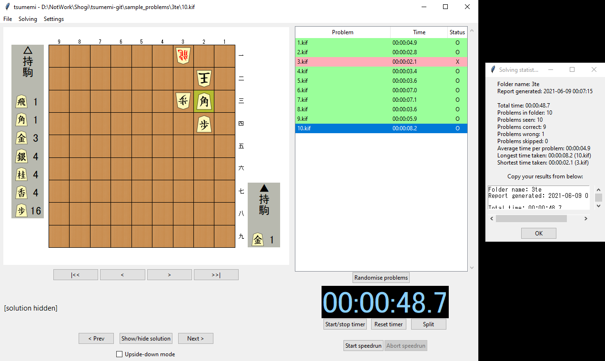

# KIF browser #

Navigate through a folder of tsumeshogi problems with ease. For each problem, see the board position and view the solution when done solving.

Shogi players may have hundreds of tsumeshogi stored in .kif files. However, as far as I'm aware there isn't a program to quickly go through these files. For stronger players who can solve each problem at a glance, the total time taken opening each file in turn can be many times more than the actual solving.

This little bit of Python aims to let shogi players train with their large collections of tsumeshogi quickly and efficiently.

## How to install ##

Python 3 is required. You can download an installer for the latest version from the [official website](https://www.python.org/). (Tested with Python 3.8.1 but *should* be compatible with Python 3.5 onwards.)

To install, download everything in this repository. To run, make sure you have Python 3 installed on your system, then double click `kif_browser_gui.py` or run it from the command line.

Comes with a free set of ten 1-te and ten 3-te problems in the folder `/sample_problems`, composed by Marken Foo.

## How to use ##

From the menu bar, "File -> Open folder...", or Ctrl-O on the keyboard opens the folder selection dialog. Select the folder containing the kifu files you want to browse.

### Free mode ###

The board position of the first file will be shown once you open a folder containing some kifu files. Click "Show/hide solution" or press H to show or hide the solution (it must be entered as the main line in the kifu file).

Press "< Prev" (or the left arrow key) or "Next >" (or the right arrow key) to go to the previous or next .kif files in the selected directory.

Check "Upside-down mode" to display the positions from gote's point of view instead, for a different style of training.

There is a simple stopwatch timer under the problem list. "Split" will record the time since the last split as the time taken to solve the current problem.

### Speedrun mode ###

The "Start speedrun" button will enter **speedrun mode**, where you can go through all the problems in the folder in order while your times for solving each are recorded.

For each problem, once you have solved it you can choose *Show solution* to check your answer and select whether you got it right or wrong (the timer will be paused while doing so). If you cannot solve the problem, you can choose to *Skip* to the next problem instead.

Your time splits for each problem are displayed in the panel on the right.

## Feedback ##

This is just a small bit of code to try making something convenient. If you encounter any bugs, let me know. Including an example of the offending .kif files that it couldn't read would help.

## Licence ##

This project is licensed under the GPLv3.

Aside from the solid colours and plain text board, this project uses [pieces and boards by Ka-hu](https://github.com/Ka-hu/shogi-pieces/) (piece .png files created from .svg files) (licensed under CC-BY-4.0)